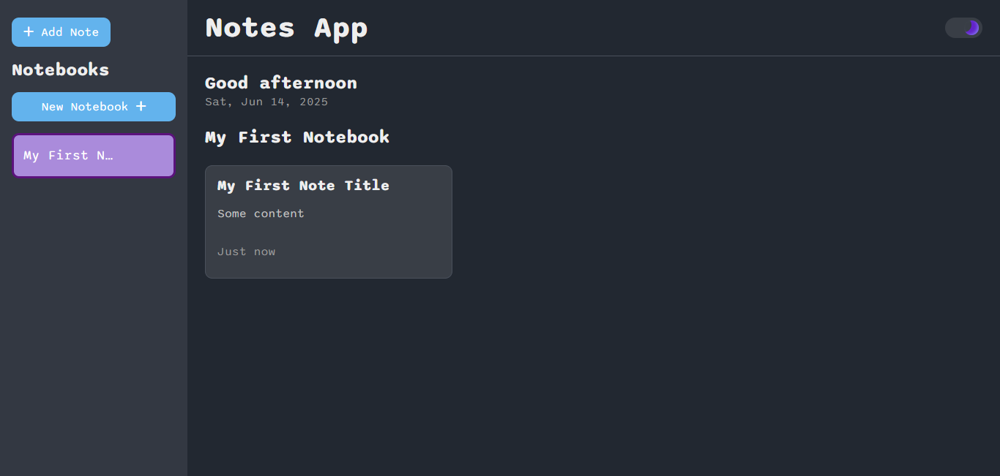
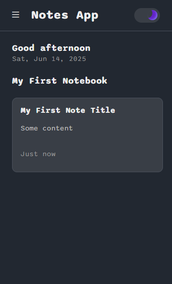

# Note Taking App

This is a client-side note-taking web application built with HTML, CSS, and vanilla JavaScript. It allows users to organize notes into different notebooks. The application features a responsive design with a collapsible sidebar for notebook management and a main content area for displaying and interacting with notes. Data is stored locally in the browser's storage.

## Table of contents

- [Screenshots](#screenshots)
- [Demo](#demo)
- [Built with](#built-with)
- [Lessons Learned](#lessons-learned)
- [Features](#features)
- [Acknowledgements](#acknowledgments)
- [Author](#author)

## Screenshots

## Demo

[Live App URL](https://gustavo2023.github.io/note-taking-app/)

## Built with

- Semantic HTML5 markup
- CSS custom properties
- Flexbox
- CSS Grid
- Mobile-first workflow
- JavaScript

## Lessons Learned

Building this note-taking app provided several valuable lessons and key takeaways:

- **State Management:** Even in a relatively simple application, managing the application's state (data) effectively is crucial. This project highlighted the importance of keeping track of the active notebook, selected notes, and any temporary UI states (like modal visibility). As the app grows, more robust state management solutions might be considered.

- **DOM Manipulation:** Working with vanilla JavaScript requires careful and efficient manipulation of the Document Object Model (DOM). This project reinforced the need to understand how to select elements, update their content and attributes, and handle events correctly to create a dynamic user interface. I learned to use more specific selectors and query elements relative to modal elements.

- **Event Handling:** A significant portion of the application's logic revolves around responding to user events (clicks, key presses, form submissions). I learned to handle events consistently, including keyboard accessibility, and to manage focus appropriately, especially when dealing with modals.

- **Data Persistence:** Storing data locally using `localStorage` and `sessionStorage` provided a practical understanding of client-side data persistence. I learned about the differences between them (persistence across sessions vs. within a single session) and their limitations (e.g., data size limits, security considerations).

- **Modularity and Reusability:** Refactoring the code to improve modularity (e.g., extracting UI rendering logic into a separate module) made the codebase more organized and maintainable. Creating reusable components (like the generic modal) reduced code duplication and improved consistency.

- **Accessibility:** Implementing ARIA attributes and managing focus highlighted the importance of making web applications accessible to users with disabilities. I learned how to use ARIA attributes to convey the purpose and state of UI elements to screen readers and how to manage focus flow for keyboard navigation.

- **Error Handling:** Logging errors to the console improved the application's robustness and made debugging easier.

- **Responsive Design:** Creating a responsive layout that adapts to different screen sizes using flexbox and CSS Grid was essential for providing a good user experience on both desktop and mobile devices.

- **Testing and Debugging:** The debugging process reinforced the importance of using browser developer tools to inspect the DOM, track events, and identify and fix errors.

## Features

### Notebook Management

- Create new notebooks.
- Rename existing notebooks.
- Delete notebooks (this action also deletes all notes within that notebook).
- Display a list of all notebooks.
- Set an active notebook to view its notes.

### Note Management

- Create new notes within the active notebook.
- Edit the title and content of existing notes.
- Delete individual notes.
- View note details (title, content, creation date).
- Notes are displayed as cards in the main content area.

### User Interface & Experience

- Responsive Design: Adapts to different screen sizes, with a collapsible sidebar for smaller screens.
- Theme Toggling: Supports light and dark themes, with the preference saved in local storage.
- Modals: Uses dialog elements for:
  - Creating and editing notes.
  - Generic confirmations (e.g., for deletions, renaming).
  - Prompts for input (e.g., new notebook name).
- Dynamic UI Updates: The interface updates in real-time based on user actions (e.g., adding a notebook, selecting a note).
- Sidebar Navigation: Easy access to notebooks and actions like creating new notes or notebooks.
- Main Content Display: Shows a greeting message, current date, the title of the active notebook, and the notes within it.
- Draft Saving: Automatically saves the content of a new note (before its first save) to session storage, allowing recovery if the modal is accidentally closed.

### Data Persistence

- Notebooks and notes are saved in the browser's localStorage.
- Theme preference is saved in localStorage.
- Unsaved new note content (drafts) are temporarily saved in sessionStorage.

### Accessibility

- Uses ARIA attributes for elements like the sidebar, buttons, and modals to improve screen reader compatibility.
- Manages focus when opening/closing the sidebar and modals.

### Input Validation

- Basic validation for non-empty strings for notebook names and note titles/content.

## Acknowledgments

This project was created as a personal endeavor to practice and enhance my web development skills. Inspiration for this project was drawn from a YouTube video: [Create, Read, Update, Delete (CRUD) in JavaScript: Note Taking App Tutorial](https://www.youtube.com/watch?v=aKP5610AEM4&list=WL&index=10&t=2092s).

## Author

- GitHub - [@gustavo2023](https://github.com/gustavo2023)
